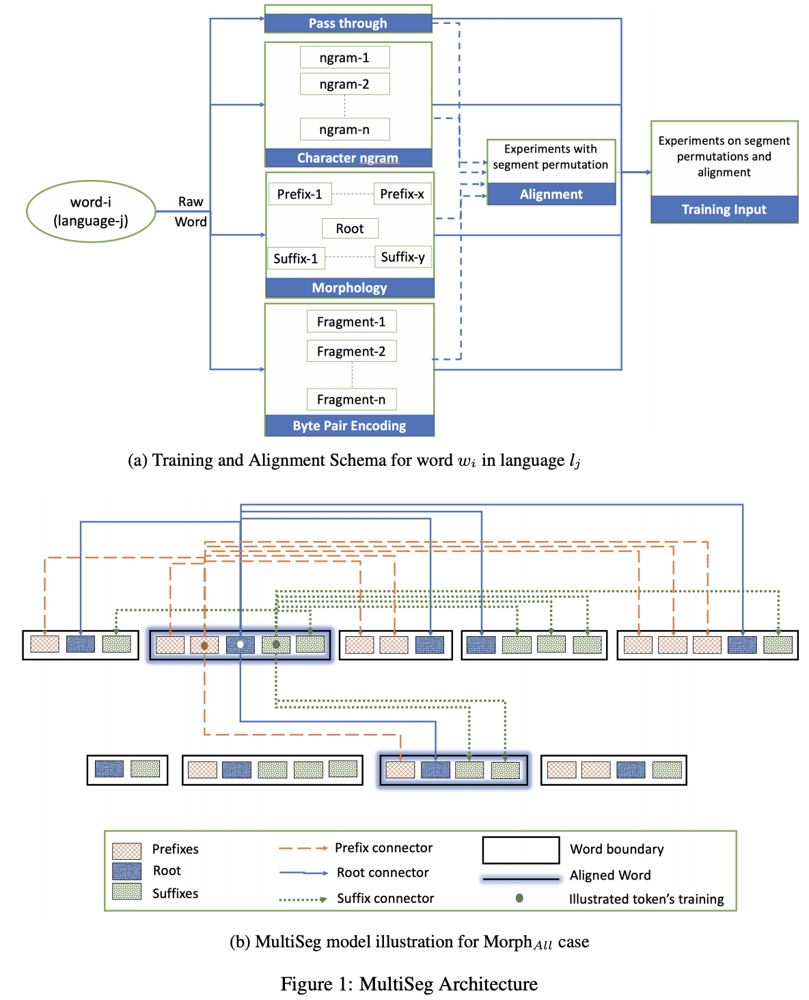

# MultiSeg
Code for paper published in LREC venue's SLTU-CCURL:

[MultiSeg: Parallel Data and Subword Information for Learning Bilingual Embeddings in Low Resource Scenarios](https://www.aclweb.org/anthology/2020.sltu-1.13.pdf)
```
@inproceedings{sarioglu-kayi-etal-2020-multiseg,
    title = "{M}ulti{S}eg: Parallel Data and Subword Information for Learning Bilingual Embeddings in Low Resource Scenarios",
    author = "Sarioglu Kayi, Efsun  and
      Anand, Vishal  and
      Muresan, Smaranda",
    booktitle = "Proceedings of the 1st Joint Workshop on Spoken Language Technologies for Under-resourced languages (SLTU) and Collaboration and Computing for Under-Resourced Languages (CCURL)",
    month = may,
    year = "2020",
    address = "Marseille, France",
    publisher = "European Language Resources association",
    url = "https://www.aclweb.org/anthology/2020.sltu-1.13",
    pages = "97--105",
    abstract = "Distributed word embeddings have become ubiquitous in natural language processing as they have been shown to improve performance in many semantic and syntactic tasks. Popular models for learning cross-lingual word embeddings do not consider the morphology of words. We propose an approach to learn bilingual embeddings using parallel data and subword information that is expressed in various forms, i.e. character n-grams, morphemes obtained by unsupervised morphological segmentation and byte pair encoding. We report results for three low resource morphologically rich languages (Swahili, Tagalog, and Somali) and a high resource language (German) in a simulated a low-resource scenario. Our results show that our method that leverages subword information outperforms the model without subword information, both in intrinsic and extrinsic evaluations of the learned embeddings. Specifically, analogy reasoning results show that using subwords helps capture syntactic characteristics. Semantically, word similarity results and intrinsically, word translation scores demonstrate superior performance over existing methods. Finally, qualitative analysis also shows better-quality cross-lingual embeddings particularly for morphological variants in both languages.",
    language = "English",
    ISBN = "979-10-95546-35-1",
}
```


Check out visualization referred in the paper: [interactive-visualization](https://vishalanand.net/sparse-multilingual-context)
#### Setting thread count equal to number of cores is optimal
```
# For Linux servers: 
  Produces say x
  - cat /proc/cpuinfo | grep "cpu cores" | uniq
 
  Produces 2x
  - grep -c ^processor /proc/cpuinfo

# For Mac:
  Produces say x (logical cores)
  - sysctl -n hw.ncpu
  
  Physical cores is x/2 for Macs (since cores are hyper-threaded)
  - "About this Mac" -> "System report" -> "Total Number of Cores"
```

## Sample parFastText bitext commands:
`cd ./multiSeg`
```
# SW 40 dimension for word-aligned vocabulary training (non-morphology) with dictionary evaluations
{ make && time ./bitext skipgram \
    -bilingual -ws 5 -minCount 5 -lrUpdateRate 100 -neg 30 -verbose 1 \
    -call_eval_dict_mult \
    -call_eval_dict_unq \
    -save_bilingual_model \
    -epoch 20 \
    -thread 12 \
    -align ../segmentations/morph_map_final/sw.word.space.sw-en.align \
    -src-train ../segmentations/morph_map_final/sw.word.sw \
    -tgt-train ../segmentations/morph_map_final/sw.word.en \
    -output ../word-embeddings/sw_word_40_bitext \
    -efsunDictionary ../data/en_sw.txt \
    -efsunDictionaryUnq ../data/en_sw_unq.txt \
    -src-lang sw \
    -tgt-lang en \
    -dim 40 ; } > ../word-embeddings/sw_word_40_bitext_out.txt 2> ../word-embeddings/sw_word_40_bitext_cerr.txt

# SW 40 dimension for stem-aligned morphology training with dictionary evaluations
{ make && time ./bitext skipgram \
    -bilingual -ws 5 -minCount 5 -lrUpdateRate 100 -neg 30 -verbose 1 \
    -call_eval_dict_mult \
    -call_eval_dict_unq \
    -save_bilingual_model \
    -epoch 20 \
    -thread 12 \
    -align ../segmentations/morph_map_final/sw.stem.space.sw-en.align \
    -src-train ../segmentations/morph_map_final/sw.word.sw \
    -tgt-train ../segmentations/morph_map_final/sw.word.en \
    -output ../word-embeddings/sw_word_morph_3_40_bitext \
    -efsunDictionary ../data/en_sw.txt \
    -efsunDictionaryUnq ../data/en_sw_unq.txt \
    -src-lang sw \
    -tgt-lang en \
    -dim 40 \
    -src_map_f ../segmentations/morph_map_final/sw.morph_3_map.sw \
    -tgt_map_f ../segmentations/morph_map_final/sw.morph_3_map.en \
    -use_morphology ; } > ../word-embeddings/sw_word_morph_3_40_bitext_out.txt 2> ../word-embeddings/sw_word_morph_3_40_bitext_cerr.txt

```

## Sample parFastText bivec commands:
`cd ./bivec`
```
# SW 40 dimension for word aligned training with dictionary evaluations
{ make && time ./bivec \
    -cbow 0 \
    -window 5 \
    -negative 30 \
    -hs 0 \
    -binary 0 \
    -eval 0 \
    -min-count 5 \
    -sample 1e-4 \
    -tgt-sample 1e-4 \
    -bi-weight 1 \
    -align ../segmentations/morph_map_final/sw.word.space.sw-en.align \
    -src-train ../segmentations/morph_map_final/sw.word.sw \
    -tgt-train ../segmentations/morph_map_final/sw.word.en \
    -output ../word-embeddings/sw_word_bivec_40 \
    -size 40 \
    -iter 20 \
    -threads 12 \
    -align-opt 1 \
    -src-lang sw \
    -tgt-lang en \
    -provided_translation_dictionary ../data/en_sw.txt \
    -provided_translation_dictionary_unq ../data/en_sw_unq.txt \
    -call_eval_mono 0 \
    -call_eval_cldc 0 \
    -call_eval_muse 0 \
    -call_eval_dict_mult 1 \
    -call_eval_dict_unq 1 ; } > ../word-embeddings/sw_word_bivec_40_out.txt 2> ../word-embeddings/sw_word_bivec_40_cerr.txt

# SW 40 dimension for stem aligned training with dictionary evaluations
{ make && time ./bivec \
    -cbow 0 \
    -window 5 \
    -negative 30 \
    -hs 0 \
    -binary 0 \
    -eval 0 \
    -min-count 5 \
    -sample 1e-4 \
    -tgt-sample 1e-4 \
    -bi-weight 1 \
    -align ../segmentations/morph_map_final/sw.stem.space.sw-en.align \
    -src-train ../segmentations/morph_map_final/sw.word.sw \
    -tgt-train ../segmentations/morph_map_final/sw.word.en \
    -output ../word-embeddings/sw_stem_bivec_40 \
    -size 40 \
    -iter 20 \
    -threads 12 \
    -align-opt 1 \
    -src-lang sw \
    -tgt-lang en \
    -provided_translation_dictionary ../data/en_sw.txt \
    -provided_translation_dictionary_unq ../data/en_sw_unq.txt \
    -call_eval_mono 0 \
    -call_eval_cldc 0 \
    -call_eval_muse 0 \
    -call_eval_dict_mult 1 \
    -call_eval_dict_unq 1 ; } > ../word-embeddings/sw_stem_bivec_40_out.txt 2> ../word-embeddings/sw_stem_bivec_40_cerr.txt

```

## Only evaluating vectors
`cd ./parfasttext`
```
# Evaluate two language vectors
{ time ./bitext eval_only \
    -src_emb ../word-embeddings/MUSE/muse-supervised-google-sw-en.vec.sw \
    -tgt_emb ../word-embeddings/MUSE/muse-supervised-google-sw-en.vec.en \
    -src-lang sw \
    -tgt-lang en \
    -dim 300 \
    -efsunDictionary ../data/en_sw.txt \
    -efsunDictionaryUnq ../data/en_sw_unq.txt \
    -call_eval_mono \
    -call_eval_cldc \
    -call_eval_muse \
    -call_eval_dict_mult \
    -call_eval_dict_unq ; } > ../word-embeddings/MUSE/muse_sw_300_out.txt 2> ../word-embeddings/MUSE/muse_sw_300_cerr.txt
```

## Split vectors into two
`cd ./make_data`
```
python split_file.py
# Please note that this has vector hardcoded written in the short python code
```

## Prepare alignment merged file for fast_align input
`cd ./make_data`
```
# Stem version parallel corpora for fast_align
python prepare_alignment.py \
    --src /Users/va/Smara_MATERIAL/parFastText/segmentations/morph_map_final/sw.stem.sw \
    --tgt /Users/va/Smara_MATERIAL/parFastText/segmentations/morph_map_final/sw.stem.en \
    --processed_alignment_input /Users/va/Smara_MATERIAL/parFastText/segmentations/morph_map_final/sw.stem.sw-en

# Word version parallel corpora for fast_align
python prepare_alignment.py \
    --src /Users/va/Smara_MATERIAL/parFastText/segmentations/morph_map_final/sw.word.sw \
    --tgt /Users/va/Smara_MATERIAL/parFastText/segmentations/morph_map_final/sw.word.en \
    --processed_alignment_input /Users/va/Smara_MATERIAL/parFastText/segmentations/morph_map_final/sw.word.sw-en
```

## Alignment convert dash to space
```
Align

sed 's/-/ /g' segmentations/morph_map_final/sw.word.sw-en.align > segmentations/morph_map_final/sw.word.space.sw-en.align
sed 's/-/ /g' segmentations/morph_map_final/tl.word.tl-en.align > segmentations/morph_map_final/tl.word.space.tl-en.align
sed 's/-/ /g' segmentations/morph_map_final/Europarl/europarl.word.de-en.align > segmentations/morph_map_final/Europarl/europarl.word.space.de-en.align

sed 's/-/ /g' segmentations/morph_map_final/sw.stem.sw-en.align > segmentations/morph_map_final/sw.stem.space.sw-en.align
sed 's/-/ /g' segmentations/morph_map_final/tl.stem.tl-en.align > segmentations/morph_map_final/tl.stem.space.tl-en.align
sed 's/-/ /g' segmentations/morph_map_final/Europarl/europarl.stem.de-en.align > segmentations/morph_map_final/Europarl/europarl.stem.space.de-en.align

# Nice to know about how smaller files are created
head -1000 segmentations/morph_map_final/Europarl/europarl.word.space.de-en.align > segmentations/morph_map_final/Europarl/mini/1k/1k_europarl.word.space.de-en.align
head -10000 segmentations/morph_map_final/Europarl/europarl.word.space.de-en.align > segmentations/morph_map_final/Europarl/mini/10k/10k_europarl.word.space.de-en.align
head -100000 segmentations/morph_map_final/Europarl/europarl.word.space.de-en.align > segmentations/morph_map_final/Europarl/mini/100k/100k_europarl.word.space.de-en.align

head -1000 segmentations/morph_map_final/Europarl/europarl.stem.space.de-en.align > segmentations/morph_map_final/Europarl/mini/1k/1k_europarl.stem.space.de-en.align
head -10000 segmentations/morph_map_final/Europarl/europarl.stem.space.de-en.align > segmentations/morph_map_final/Europarl/mini/10k/10k_europarl.stem.space.de-en.align
head -100000 segmentations/morph_map_final/Europarl/europarl.stem.space.de-en.align > segmentations/morph_map_final/Europarl/mini/100k/100k_europarl.stem.space.de-en.align

```

## Generate alignment
```
git clone https://github.com/clab/fast_align.git && mkdir fast_align/build && cd fast_align/build
cmake ..
make
cd ../../

# Stem version
time ./fast_align/build/fast_align \
        -i segmentations/morph_map_final/sw.stem.sw-en \
        -d -o -v > segmentations/morph_map_final/sw.stem.sw-en.forward.align
time ./fast_align/build/fast_align \
        -i segmentations/morph_map_final/sw.stem.sw-en \
        -d -o -v -r > segmentations/morph_map_final/sw.stem.sw-en.reverse.align
time ./fast_align/build/atools \
        -i segmentations/morph_map_final/sw.stem.sw-en.forward.align \
        -j segmentations/morph_map_final/sw.stem.sw-en.reverse.align \
        -c grow-diag-final-and > segmentations/morph_map_final/sw.stem.sw-en.align

# Word version
time ./fast_align/build/fast_align \
        -i segmentations/morph_map_final/sw.word.sw-en \
        -d -o -v > segmentations/morph_map_final/sw.word.sw-en.forward.align
time ./fast_align/build/fast_align \
        -i segmentations/morph_map_final/sw.word.sw-en \
        -d -o -v -r > segmentations/morph_map_final/sw.word.sw-en.reverse.align
time ./fast_align/build/atools \
        -i segmentations/morph_map_final/sw.word.sw-en.forward.align \
        -j segmentations/morph_map_final/sw.word.sw-en.reverse.align \
        -c grow-diag-final-and > segmentations/morph_map_final/sw.word.sw-en.align
```

## Prepare morphological and standard inputs from raw input
`cd ./make_data`
```
python new_morph_Rami.py
# Please note this has vectors hardcoded into the short python code

```
